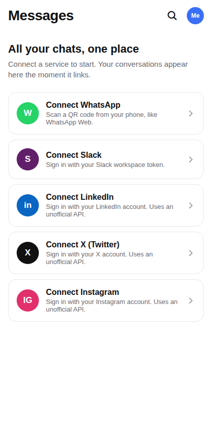
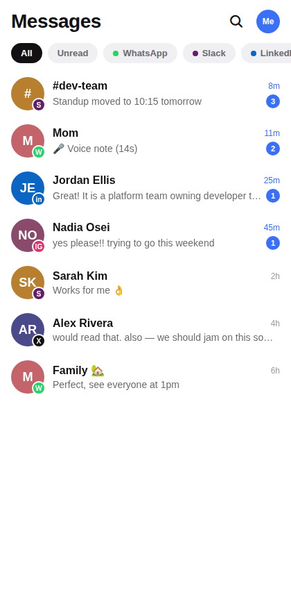
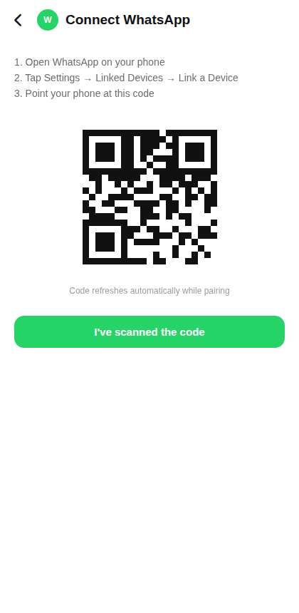
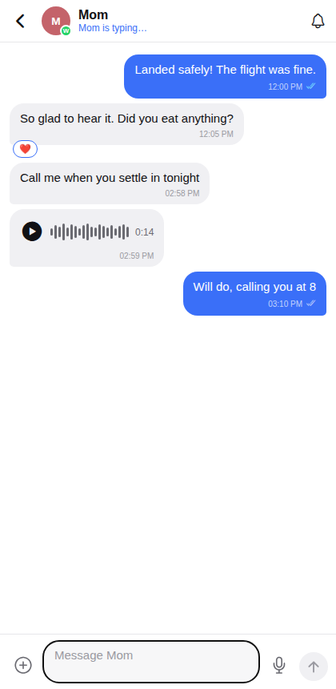
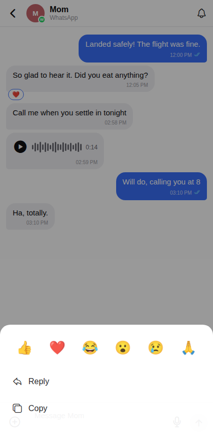
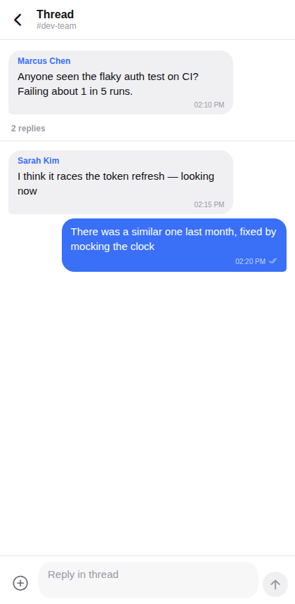
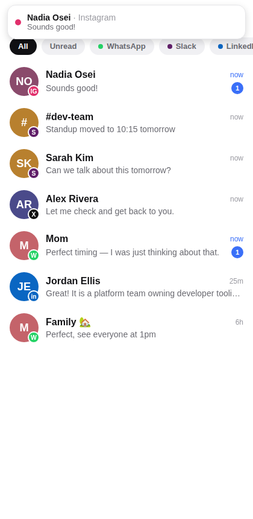
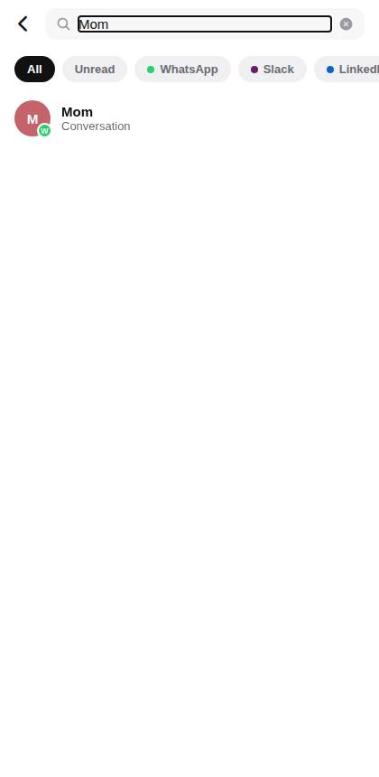
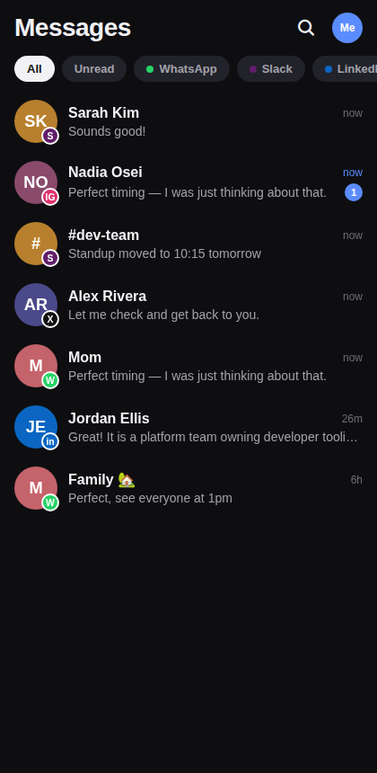

# Capability verification report

Every user-facing capability of the app was exercised end-to-end in a real
browser (Chromium driving the Expo web build at 420×860, via
`app/e2e/verify.js`). **30/30 checks passed.**

Run it yourself:

```bash
cd app && npx expo start --web --port 8081   # terminal 1
cd app && node e2e/verify.js                 # terminal 2 (needs `npm i -D playwright` or a global install)
```

## Results

| # | Capability | Result |
|---|---|---|
| 1 | Onboarding: empty inbox shows connect-as-you-go cards for all 5 services | ✅ |
| 2 | Connect WhatsApp: QR pairing screen and completion flow | ✅ |
| 3 | Connect Slack: token flow, submit gated until token entered | ✅ |
| 4–6 | Connect LinkedIn / X / Instagram: credential flows with unofficial-API warning | ✅ |
| 7 | Inbox: merged list, service badges, unread counts, voice-note preview | ✅ |
| 8 | Filter chips: per-service and Unread filtering | ✅ |
| 9 | Chat: opens, renders history incl. voice notes, clears unread | ✅ |
| 10 | Send: status ticks → read, typing indicator, simulated reply arrives | ✅ |
| 11 | Reactions: long-press to react, pill renders, toggles off | ✅ |
| 12 | Reply-quoting: quote bar, quoted preview in sent bubble | ✅ |
| 13 | Copy message action | ✅ |
| 14 | Media: attach and send an image | ✅ |
| 15 | Voice note: record and send (WhatsApp) | ✅ |
| 16 | Adaptive: X chat has no mic, no typing indicator, read receipts on | ✅ |
| 17 | Adaptive: LinkedIn sheet has reactions but no Reply | ✅ |
| 18 | Adaptive: Slack send stays at delivered (no read receipts) | ✅ |
| 19 | Slack threads: reply-count indicator, thread view, reply in thread | ✅ |
| 20 | Slack sheet: "Reply in thread" offered, plain Reply absent | ✅ |
| 21 | Group chat: sender names, multi-person reaction counts | ✅ |
| 22 | Notifications: in-app banner for incoming message when not viewing | ✅ |
| 23 | Notifications: per-chat mute suppresses banner | ✅ |
| 24 | Notifications: per-service toggle suppresses banner | ✅ |
| 25 | Inbox long-press: mark-as-read and mute | ✅ |
| 26 | Search: message content + conversation names, service filter applies | ✅ |
| 27 | Appearance: dark mode applies and persists across reload | ✅ |
| 28 | Persistence: connected services survive reload | ✅ |
| 29 | Disconnect: removes conversations, chip, restores connect card | ✅ |
| 30 | Appearance: back to light mode | ✅ |

## Screenshots

| | |
|---|---|
|  |  |
|  |  |
|  |  |
|  |  |
|  | |

## Scope notes

- The app runs against the seeded provider (`src/data/seed.ts` behind
  `src/store/ChatStore.tsx`); the Matrix provider that talks to the bridge
  server will implement the same store contract. Live-service behavior
  (real WhatsApp pairing, bridge reconnects) can only be verified against a
  deployed `server/` stack with real accounts.
- Contact replies, typing windows, and delivery-status transitions are
  simulated by the provider so those capabilities are exercisable end-to-end.
